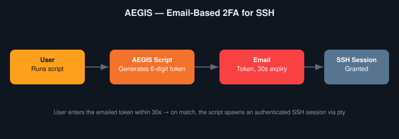

# 🛡️ AEGIS — Email-Based 2FA for SSH

  

AEGIS enhances SSH security with email-based two-factor authentication. The customizable script can be easily implemented on personal systems with an expiration time of 30 seconds, or to whatever expiration time you desire.

Displays examples of working knowledge related to cyber security and coding.

Comments are given explaining the logic behind the code.
